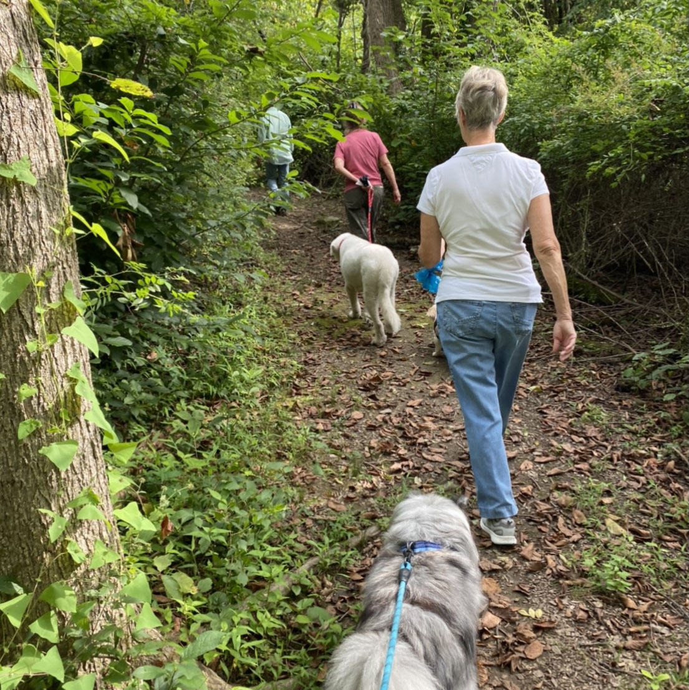

September 12 – Opalanie Park – 1422 St. Matthews Road

October 17 – Natural Lands Bryn Coed Preserve – 1869 Flint Road

Meet at 9:00 a.m. and plan for a gentle 2 mile trek.  Long pants and sturdy shoes are a good idea.  Dogs must be on leashes.

Explore our beautiful parks and meet your neighbors.

