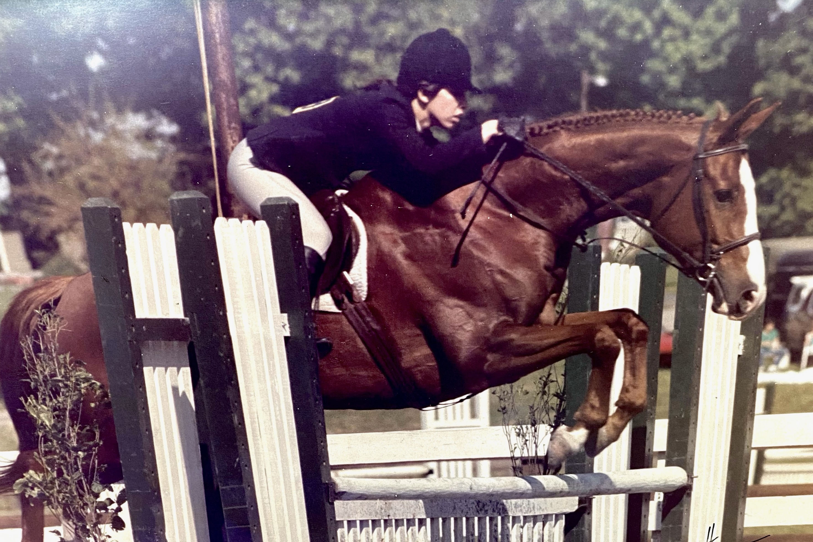

Saturday, Sunday, and Monday, 11 a.m. – 5 p.m. each day

Visit our West Vincent Community Tent.

All are welcome. Volunteer through&nbsp;[SignUpGenius](https://www.signupgenius.com/go/8050A4BA4A62FABFA7-ludwigs).

<figcaption>
  Photos of Dana on her first pony Woodlands Moon Shadow “Dan” at the age of 16
  and on her last horse  Indiscrete “Chester” – both photos at Ludwig’s Corner
  Horse Show - one of her favorite shows to ride&nbsp;in.
</figcaption>
